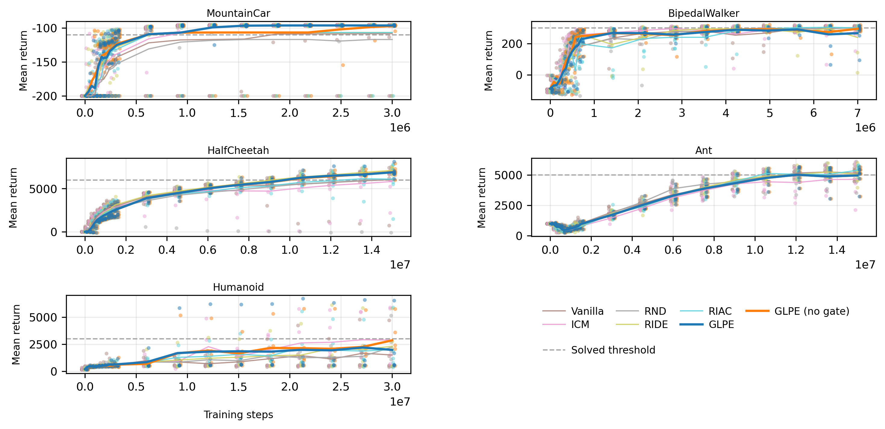

### 5.1 Learning Curve Performance

Learning curves versus environment steps showed that GLPE without gating tracked the strongest baseline closely across most tasks, with stable behavior across random seeds. The gated variant differed most clearly in exploration-sensitive settings. On MountainCar-v0, gating remained beneficial and supported strong upward progression. On Humanoid-v5, between-seed variance was large for all methods, and gating tended to be conservative in some runs.

On MuJoCo locomotion tasks, where extrinsic reward was denser, both GLPE variants behaved similarly and stayed within a modest gap of the strongest intrinsic baseline in the curve-level view [6,15]. This pattern indicated that GLPE retained competitiveness even when dense task reward reduced the relative advantage of additional exploration shaping.

The curve-level perspective also clarified that ranking differences were task-dependent rather than uniform. MountainCar-v0 favored GLPE strongly, whereas BipedalWalker-v3 and MuJoCo tasks showed closer competition among several methods.

Figure 5.1. Evaluation learning curves for GLPE and baseline intrinsic-reward methods.

