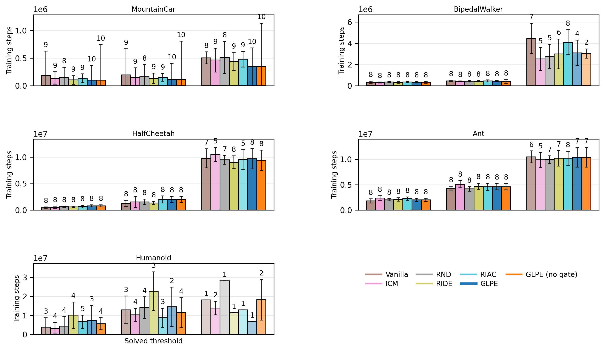

### 5.3 Thresholded Reliability and Steps-to-Threshold

Thresholded analysis was used to separate delayed attainment from complete non-attainment. Solved-threshold statistics showed that both GLPE variants solved MountainCar-v0 in all seeds, each at a median of 0.35M steps, while the most reliable baseline solved 9 of 10 seeds at 0.44M steps [15].

At solved level, reliability differed more on tasks near the performance cutoff. On BipedalWalker-v3, GLPE solved 4 of 8 seeds and GLPE without gating solved 2 of 8, while RIAC solved 8 of 8 but at a slower median of 4.09M steps [2]. On Humanoid-v5, solved-threshold reach counts were low across methods, which was consistent with the high-variance behavior seen in learning curves.

At 50 percent threshold, GLPE without gating reached the target in all seeds on four tasks and in 4 of 5 seeds on Humanoid-v5, matching the strongest baseline reach count on each environment. The gap between 50 percent and 100 percent success therefore concentrated on high-variance or near-cutoff regimes rather than on early competence acquisition.

Figure 5.2. Sample efficiency and reliability at fixed return thresholds.

Table 5.2. Reliability and speed at solved threshold.

| Environment | GLPE | GLPE (no gate) | Most reliable baseline |
|---|---|---|---|
| MountainCar-v0 | 10/10; 0.35M | 10/10; 0.35M | RIDE: 9/10; 0.44M |
| BipedalWalker-v3 | 4/8; 3.10M | 2/8; 3.04M | RIAC: 8/8; 4.09M |
| Ant-v5 | 7/8; 10.39M | 7/8; 10.39M | RIAC: 8/8; 10.22M |
| HalfCheetah-v5 | 8/8; 9.68M | 8/8; 9.42M | RIDE: 8/8; 9.03M |
| Humanoid-v5 | 1/5; 6.73M | 2/5; 18.23M | ICM: 2/5; 13.93M |

Table 5.3. Reliability and speed at 50 percent solved threshold.

| Environment | GLPE | GLPE (no gate) | Most reliable baseline |
|---|---|---|---|
| MountainCar-v0 | 10/10; 0.12M | 10/10; 0.11M | RIDE: 9/10; 0.13M |
| BipedalWalker-v3 | 8/8; 0.44M | 8/8; 0.41M | ICM: 8/8; 0.41M |
| Ant-v5 | 8/8; 4.61M | 8/8; 4.61M | RND: 8/8; 4.18M |
| HalfCheetah-v5 | 8/8; 2.01M | 8/8; 2.01M | Vanilla PPO: 8/8; 1.28M |
| Humanoid-v5 | 2/5; 14.51M | 4/5; 11.47M | ICM: 4/5; 10.32M |
