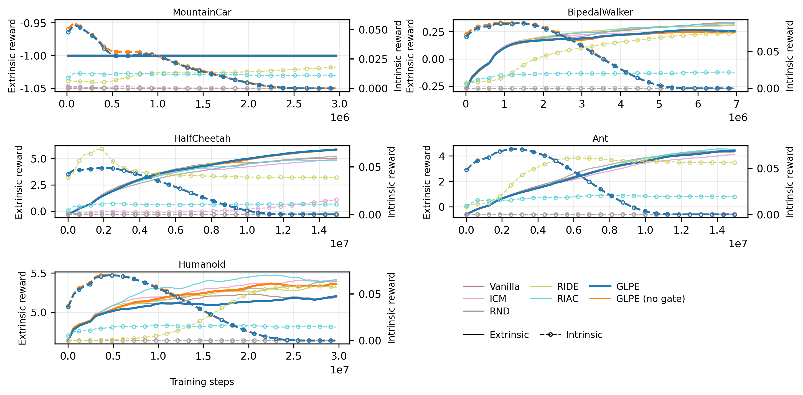

### 5.5 Intrinsic Reward Dynamics

The intrinsic term in GLPE was designed as a temporary exploration aid rather than a persistent optimization target. Training therefore applied a cosine taper to the intrinsic coefficient so that intrinsic shaping weight decreased over time.

Reward decomposition diagnostics showed that GLPE and GLPE without gating reduced applied intrinsic contribution later in training, whereas several baselines retained nonzero intrinsic contribution throughout a larger fraction of training [6,13,15]. This behavior was consistent with the objective of reducing long-horizon dependence on intrinsic shaping once useful behavior had emerged.

Because evaluation used extrinsic return only, these diagnostics were interpreted as training-signal analysis rather than direct outcome metrics. Even so, the dynamics supported the intended mechanism of early exploration support followed by gradual emphasis on task reward.

Figure 5.3. Decomposition of rollout reward during training.

