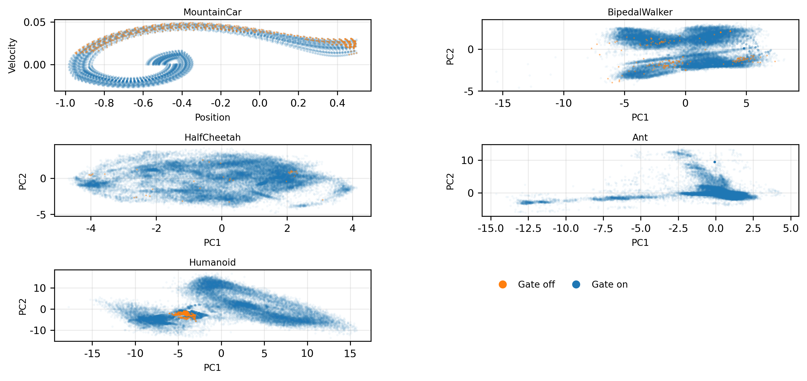

### 5.6 Gating Behavior Analysis

State-space gate maps from final checkpoints indicated that gate-off events occupied a small and typically localized subset of visited states. For MountainCar-v0, visualization used raw position and velocity. For higher-dimensional tasks, observations were z-scored and projected onto the first two principal components before plotting.

This pattern supported the interpretation that gating acted as a targeted guardrail against potentially unhelpful intrinsic shaping in persistently high-error and low-progress regions, rather than suppressing intrinsic motivation globally. The mechanism was therefore selective in application and preserved intrinsic shaping over most of the visited distribution.

Task-level outcomes remained mixed. Gating was beneficial in MountainCar-v0, while GLPE without gating was often similar or slightly stronger on dense-reward locomotion tasks. This result was consistent with a tradeoff between selective robustness and additional computational overhead.

Figure 5.4. State-space view of GLPE gating decisions from final-checkpoint trajectories.

