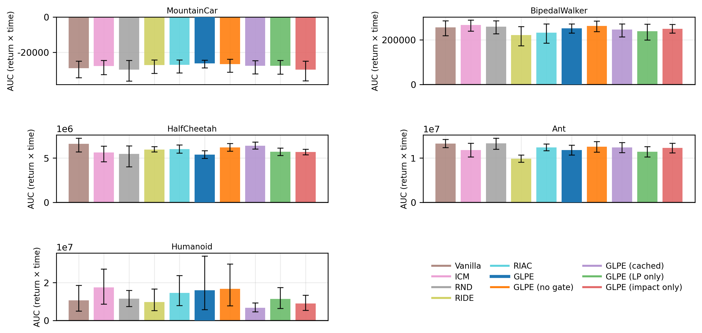
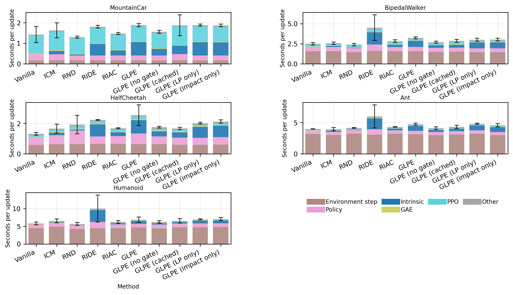

### 5.7 Wall-Clock Efficiency and Computational Overhead

Wall-clock AUC was computed under a common per-task time horizon equal to the minimum final runtime among compared methods, with curves truncated to that horizon and without extrapolation . This definition prevented slower methods from receiving extra area by running longer.

Under this wall-clock view, GLPE without gating stayed close to the strongest baseline on BipedalWalker-v3, HalfCheetah-v5, Ant-v5, and Humanoid-v5 . The gated variant usually produced lower wall-clock AUC, which was consistent with additional robust-statistics and gating computations .

Per-update timing decomposition showed that environment stepping and PPO optimization dominated runtime on expensive MuJoCo tasks, while intrinsic overhead became proportionally more important on MountainCar-v0 where environment interaction was cheap [19]. A microbenchmark of gating-median recomputation showed 20,877 transitions per second for recomputation every update and 100,173 transitions per second with cache refresh every 64 updates, corresponding to a 4.83x throughput increase . Since cached medians can alter gating decisions when stale, this optimization was treated as an implementation option rather than a core benchmark condition .

Figure 5.5. Wall-clock AUC of evaluation performance under a common time horizon.

Figure 5.6. Timing breakdown per PPO update.

